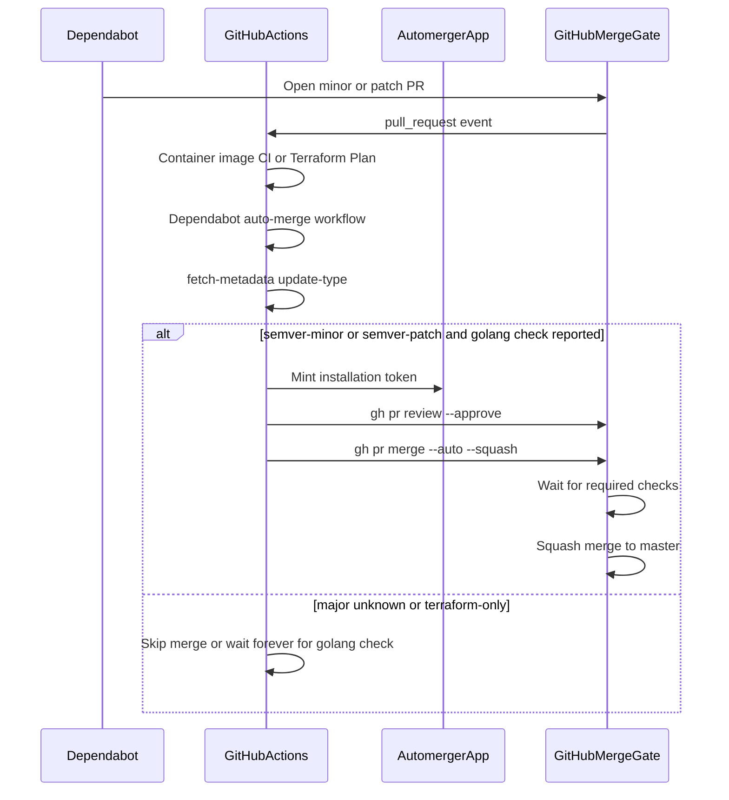
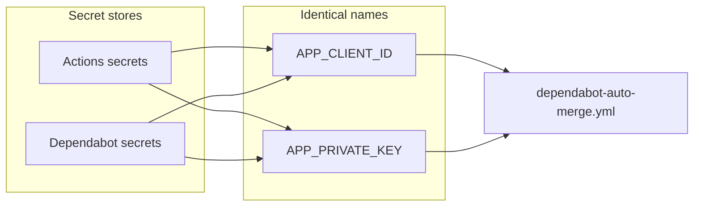

# Dependabot automation

Minor and patch Dependabot pull requests are approved and squash-merged by the `automerger` GitHub App after required CI passes. Major and non-semver updates stay open for manual review.

See [ADR-001](decisions/001-dependabot-auto-merge.md) for why a GitHub App is used and why code-owner reviews are **not** a merge gate.

This is **not** the cherry-pick GitHub App. Runtime env `GITHUB_APP_ID` / `GITHUB_APP_PRIVATE_KEY_PEM_BASE64` stay dedicated to cherry-pick. Automerger uses `APP_CLIENT_ID` / `APP_PRIVATE_KEY`.

## How it works

What gets auto-merged (after `ci / validate / Validate golang layer` is green):

- `version-update:semver-minor`
- `version-update:semver-patch`

What stays manual:

- `version-update:semver-major`
- `version-update:semver-unknown` (typical for some Docker tags)
- Terraform Dependabot PRs under `/terraform` (golang CI is path-filtered out; do not require `Terraform Plan` globally or go/docker PRs never merge)
- Any PR not authored by `dependabot[bot]`

`--auto` does **not** wait inside the job. GitHub merges later, only if branch protection is satisfied. If required status checks are missing, GitHub can squash-merge as soon as the App approves.

## Repository files

- [`.github/workflows/dependabot-auto-merge.yml`](../.github/workflows/dependabot-auto-merge.yml) — approve + enable squash auto-merge
- [`.github/dependabot.yml`](../.github/dependabot.yml) — daily gomod, docker, github-actions, and terraform updates, `dependencies` label, assignee `@ealebed`
- [`.github/CODEOWNERS`](../.github/CODEOWNERS) — review requests to `@ealebed` (not a merge requirement)

The auto-merge workflow never checks out the pull request branch.

## GitHub App

App: `automerger` (user-owned). Webhook disabled. Installed on selected repositories. Do not use `ealebed-cherry-pick-poc` for this workflow.

Repository permissions:

- **Contents**: Read and write (merge)
- **Pull requests**: Read and write (approve, enable auto-merge)
- **Metadata**: Read-only (required)

The workflow mints a short-lived installation token with [`actions/create-github-app-token@v3`](https://github.com/actions/create-github-app-token) using **Client ID** + private key PEM. Do not use an OAuth client secret.

[Making authenticated API requests with a GitHub App in a workflow](https://docs.github.com/en/apps/creating-github-apps/authenticating-with-a-github-app/making-authenticated-api-requests-with-a-github-app-in-a-github-actions-workflow)

## Secrets

Dependabot-triggered `pull_request` jobs only see **Dependabot** secrets, not Actions secrets or variables. Store the **same names** in both stores:

| Name | Store | Value |
| --- | --- | --- |
| `APP_CLIENT_ID` | Actions **and** Dependabot secrets | Automerger GitHub App Client ID (`Iv1…` / `Iv23…`) |
| `APP_PRIVATE_KEY` | Actions **and** Dependabot secrets | Automerger full PEM, including BEGIN/END lines |

Do not put the cherry-pick app PEM in `APP_PRIVATE_KEY`. If a Dependabot run fails with an empty Client ID or private key, the values were added only under Actions secrets.

`TF_API_TOKEN` is used by Terraform Plan. It is unrelated to automerger. If Terraform Plan fails on Dependabot PRs with an empty token, add `TF_API_TOKEN` to the Dependabot secret store as well.

## Branch protection (`master`)

Required so auto-merge cannot skip CI:

- Require a pull request before merging
- Required approving reviews: **1**
- **Do not** require review from Code Owners
- Dismiss stale reviews when new commits are pushed (the workflow re-approves on `synchronize`)
- Require status checks to pass before merging
- Required check: `ci / validate / Validate golang layer` (observed on PRs from [Container image CI](../.github/workflows/wfl_image_ci.yaml)). Do **not** require `ci / build-push-image` (skipped on pull requests). Do **not** require `Terraform Plan` (unreported on go/docker PRs).
- Container image CI path filters include `go.mod` / `go.sum`, `Dockerfile`, `internal/**.go`, `cmd/**.go`, and `.github/workflows/**`.
- Require conversation resolution: **off**
- Allow auto-merge: **on**
- Squash merging: **on**
- No force pushes, no deletions

## Rollout order

App install, secrets, auto-merge, squash, and branch protection (including required check `ci / validate / Validate golang layer`, and **not** `Terraform Plan`) are already configured for this repository. Merge the workflow into `master` last so a minor/patch Dependabot PR cannot merge before tests finish.

If branch protection currently requires `Terraform Plan`, remove it before this lands or go/docker Dependabot PRs will never merge.

## Verify

1. Minor or patch gomod/docker/actions Dependabot PR: App approval, auto-merge queued, squash merge after golang validate is green.
2. Terraform Dependabot PR: workflow may approve, auto-merge stays queued (golang check never reports). Merge by hand after Terraform Plan is green.
3. Major or `semver-unknown` Dependabot PR: workflow runs, no App approval, PR stays open.
4. Human PR: workflow job skipped (`dependabot[bot]` guard).
5. On a Dependabot-triggered run, `Create GitHub App token` can read both automerger secrets.
